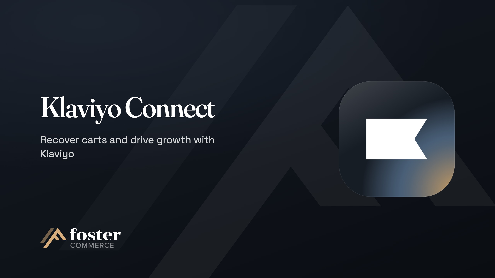

# Klaviyo Connect

Sends Craft Commerce carts, orders and customers to Klaviyo, so you can run email and SMS flows from what shoppers do.

## Overview

- Power abandoned cart reminders and post-purchase follow-ups without touching your templates: cart and order events go to Klaviyo from the server as they happen.
- Personalize customer experiences, with Craft users synced to Klaviyo profiles and the fields and Twig values you choose.
- Build welcome series and any flow your marketing team imagines, from your own events and list signups sent from your templates.
- Bring shoppers back to the cart they left, from a link in your abandoned cart emails.
- Start with your history: send past orders to Klaviyo, so flows and reports have data from the first day.
- Nudge shoppers about products that caught their eye, with Viewed Product tracking from your product templates for browse abandonment flows.
- Run each site or store on its own Klaviyo account and lists, or share one.

## How it works

Add each site's Klaviyo API keys in the plugin settings, and Klaviyo Connect starts sending cart, order and customer data to Klaviyo. It sends from the server through Craft's queue, so your templates stay as they are and a slow Klaviyo doesn't delay checkout. You choose which events and order data to send in the plugin settings.

## Requirements

- Craft CMS `^5.6.0`
- Craft Commerce `^5.1.0`, for cart and order events
- PHP `^8.2`

## Install

```sh
composer require fostercommerce/klaviyoconnect
./craft plugin/install klaviyoconnect
```

## Documentation

- [Getting started](https://www.fostercommerce.com/craft-cms-plugins/klaviyo-connect/docs/getting-started), install and first setup
- [Configuration](https://www.fostercommerce.com/craft-cms-plugins/klaviyo-connect/docs/reference/configuration), every setting
- [Actions](https://www.fostercommerce.com/craft-cms-plugins/klaviyo-connect/docs/reference/actions), forms and links that send events, profiles and list signups
- [PHP events](https://www.fostercommerce.com/craft-cms-plugins/klaviyo-connect/docs/dev-guide/php-events), for adding your own properties to profiles and events

## License

Proprietary

---

<a href="https://www.fostercommerce.com" target="_blank"></a>
