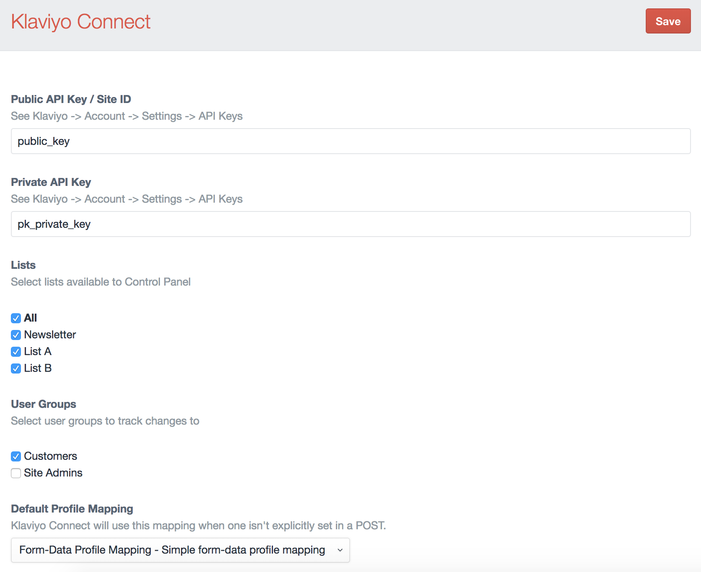

# Configuration

Within the Craft Control Panel, navigate to Settings and click the Klaviyo Connect icon to open the plugin's configuration section.

*Navigate to Settings → Plugins → Klaviyo Connect → Settings*

**Note**: Site ID and Private API Key can be found here: [https://www.klaviyo.com/account#api-keys-tab](https://www.klaviyo.com/account#api-keys-tab)

## Public and Private API Keys

First, include your Klaviyo Public and Private API keys and click save to connect to Klaviyo.

You can access these keys by logging into Klaviyo, and clicking your account icon (in the upper right) and selecting Account, then clicking the Settings menu and then selecting "API Keys". Or click here: [https://www.klaviyo.com/account#api-keys-tab](https://www.klaviyo.com/account#api-keys-tab)

Copy your Public API Key/Site ID and your Private API Keys. If you do not see any Private API Keys, you may need to create on first by clicking the Create API Key button.

*Save these settings in the Klaviyo Connect configuration section before setting the other configuration options.*

## Lists

Once you have saved your API Keys, this field will be automatically populated with your Klaviyo Profile Lists allowing you to select which ones will be available to the "Klaviyo List" and "Klaviyo Lists" field types.

## User Groups

Optional. Select which user groups you would like to limit tracking to. Default is all guests and users.

## Event Prefix

If you'd like to add a prefix to all events. For example, you might like to have the 'Placed Order' event show in Klaviyo as `(CC) Placed Order`. Leave blank for no prefix.

## Cart URL

The URL to your store's cart.

## Image Field Handle

The handle of the asset field you use for product images. These images will then be available within Klaviyo.

## Image Transform

The handle of the native Craft image transform you would like to use on the above product images.
